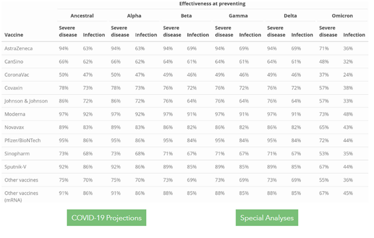
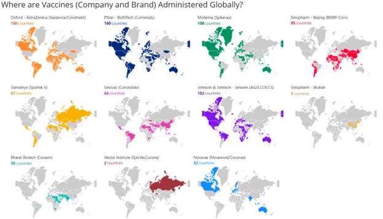
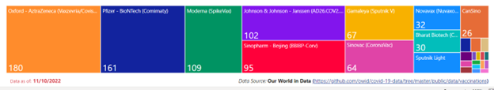
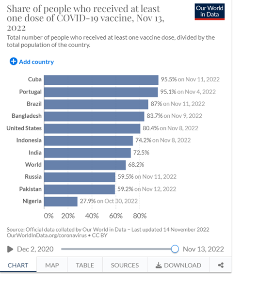

# COVID-19 data analysis 
#### Derived from Kumud Majumder

 

### Sources 
> 1. [COVID-19 vaccine efficacy summary | Institute for Health Metrics and Evaluation (healthdata.org)](https://www.healthdata.org/covid/covid-19-vaccine-efficacy-summary)
>
> 2. [Global Covid Vaccinations – CDC](https://covid.cdc.gov/covid-data-tracker/#global-vaccinations)
> 
> 3. [Vaccination by manufacturer](https://raw.githubusercontent.com/owid/covid-19-data/master/public/data/vaccinations/vaccinations-by-manufacturer.csv)

### Vaccine Efficacy Data

1. You’re telling a story on Breakthrough Covid-19 Infection- Why it might be happening, simply based on Vaccine efficacy data perspectives
[COVID-19 after Vaccination: Possible Breakthrough Infection (cdc.gov)](https://www.cdc.gov/coronavirus/2019-ncov/vaccines/effectiveness/why-measure-effectiveness/breakthrough-cases.html)

2. Parse the data and generate data set GROUPED by Country, Year and Vaccine Type.
    Now you’ve data that shows how many vaccinations have been given by type. This allows you to create protection data for the three major variants.
    What the data tells you is that you only need to analyze only the end of the year data to gather info on vaccination for that year for a country by vaccine type. WHY? I want you to think it through.
3. Use this munged/wrangled/transformed data to start your VIZ project.
4. Take the transformed data and further group by Country, and Year. This data automatically factors in the vaccine efficacy for each vaccine type. WHY this way? Because an average person only thinks vaccine as vaccine, independent of vaccine type. 
5. Data from #4 now can be used to line diagram for each country. Your goal is to show what percentage of the vaccinations did not offer protection for each of the three types. For example, you can show for each country, for 100 vaccinations, x% is susceptible for Break out for Original/Alpha, y% for Gamma and z% for Omicron. This graph is to be drawn for each country.
6. Be Creative and present the data in other Viz formats to tell your story.
7. To be more effective, now take only the latest numbers for susceptibility and plot against the % of total population protected for any country. [Coronavirus (COVID-19) Vaccinations - Our World in Data](https://ourworldindata.org/covid-vaccinations).

For example, you’ll end up with data like this. Of the 95.5% people vaccinated in Cuba (see chart below), x+4.5% people are susceptible for infection by alpha variant (this includes breakthrough infections). To keep life simple you can show only the possibility of infection. But, if you can find a way to show both infection and hospitalization, that’ll be the best.

